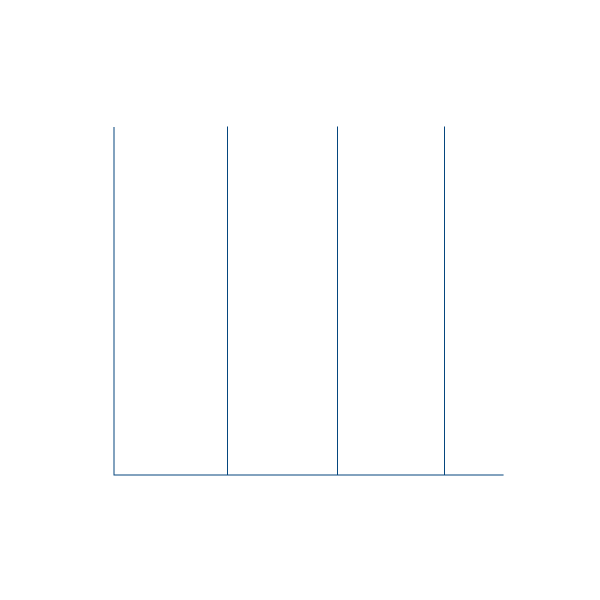

<h1 align="center"><b>Hi , I'm Hoang Phi </b></h1>

  

## 🧑‍💻<b>About me</b>

 

- 🔭 I am pursuing a Bachelor's degree in <b>Software Engineering</b> at <a href="https://iuh.edu.vn">Industrial University of Ho Chi Minh City.</a>
- 👨‍💻 I'm deeply passionate about developing fullstack websites and applications.
- 🍵 I love working with Java.
- 📧 How to reach me: <a href="mailto:hoangphi1232003@gmail.com">hoangphi1232003@gmail.com</a>
   

##  <b>Tech stack</b>

- ### Programming Languages

  
  
  

- ### Frameworks and Libraries

  
  
  
  

- ### Databases
  
  
  
  

## <b> Stats </b>

## <b> Let's Connect!</b>

